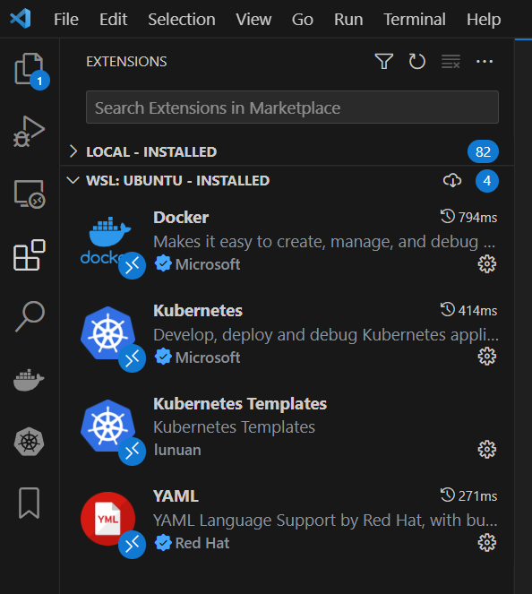
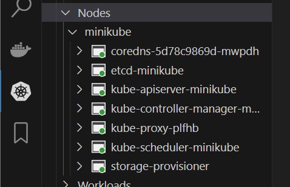

# sgt-k8s-2023
She Goes Tech bootcamp 2023

Kubernetes intro and labs.

## Prereqs
Install Vscode [https://code.visualstudio.com/docs/setup/linux]
```
sudo apt-get install wget gpg
wget -qO- https://packages.microsoft.com/keys/microsoft.asc | gpg --dearmor > packages.microsoft.gpg
sudo install -D -o root -g root -m 644 packages.microsoft.gpg /etc/apt/keyrings/packages.microsoft.gpg
sudo sh -c 'echo "deb [arch=amd64,arm64,armhf signed-by=/etc/apt/keyrings/packages.microsoft.gpg] https://packages.microsoft.com/repos/code stable main" > /etc/apt/sources.list.d/vscode.list'
rm -f packages.microsoft.gpg
sudo apt install apt-transport-https
sudo apt update
sudo apt install code
```
Install extensions: Docker, Kubernetes, Kuberentes Templates



## Kuberentes tools
Source: [https://kubernetes.io/docs/tasks/tools/]

- kubectl
```
curl -LO "https://dl.k8s.io/release/$(curl -L -s https://dl.k8s.io/release/stable.txt)/bin/linux/amd64/kubectl"
sudo install -o root -g root -m 0755 kubectl /usr/local/bin/kubectl
   
```
- helm
```
curl -fsSL -o get_helm.sh https://raw.githubusercontent.com/helm/helm/main/scripts/get-helm-3
chmod 700 get_helm.sh
sudo ./get_helm.sh
```
- minikube
```
curl -LO https://storage.googleapis.com/minikube/releases/latest/minikube-linux-amd64
sudo install minikube-linux-amd64 /usr/local/bin/minikube
```

## Local kubernetes cluster 
[https://minikube.sigs.k8s.io/docs/start/]

Start minikube with ```minikube start```

### Quick look at Kuberenets cluster resources
Node minikube and services


Command: 
```
kubectl get all -n kube-system
```
- DaemonSets
- Deployments
  Something stateless or without the state, e.g., web services
- ReplicaSets
  How many pods of deployment to run in parallel
- Pods
  Smallest resource in k8s where can be one or more (Docker) containers
- Statefulsets
  Something with the state, e.g., databases, disk storages

### Configmaps
```
kubectl get configmap
```
Used to store configuration for pods or other resources

### Secrets
```
kubect get secrets
```
Encrypted data. Used for passwords, TLS certificates. Data is encrypted, of course, but not secure by default.

### Storage
```
kubectl get pv
kubectl get pvc --namespace SOMENAMESPACE
```
Persistent Volume (PV) is a disk, HDD, SDD, logical disk, etc., which is attached to pods with Persistent Volume Claims (PVC). PV is cluster-wide, means is not tight to some namespace. While PVC is within some namespace, usually, where is the pod PV needs to be attached to.

## LAB work
Create nginx deployment:
- nginx itself
- service to load balance requests

Steps
- Create namespace nginx-lab
```kubectl create ns nginx-lab```
- Create configmap nginx 
```kubectl create -f lab1/configmap.yaml```
- Create deployment nginx
```kubectl apply -f lab1/deployment.yaml```
- Scale out deployment to 2 replicas
```kubectl scale deployment nginx --namespace nginx-lab --replicas 2
```
- Create service nginx
```kubectl apply -f lab1/service.yaml```
- Use Port-forward to access service/pod inside Kubernetes cluster
```kubectl port-forward svc/nginx --namespace nginx-lab 8080:80```
Access nginx service on http://localhost:8080/
- Change svc label selector to 'app: nginx1' and apply change
```kubectl apply -f lab1/service.yaml```
Try to access nginx service on http://localhost:8080/. Is nginx available?
- Change svc label selector back to 'app: nginx' and apply change
```kubectl apply -f lab1/service.yaml```
